# Jarkom-Modul-4-IT27-2024

## IT 27

| No  | Nama Anggota          | NRP        |
| --- | --------------------- | ---------- |
| 1   | Danendra Fidel Khansa | 5027231063 |
| 2   | Farida Qurrotu A'yuna | 5027231015 |

## IP PREFIX

`10.77`

## DAFTAR ISI

- [Rute Subnet](#rute-subnet)
- [VLSM](#vlsm)
- [CIDR](#cidr)

## Topologi Cisco Packet Tracer | VLSM |


## RUTE SUBNET

| Nama Subnet | Rute                                                                                        | Jumlah IP | Netmask |
| ----------- | ------------------------------------------------------------------------------------------- | --------- | ------- |
| A1          | Hololive > HoloEN                                                                           | 2         | /30     |
| A2          | Hololive > HoloEN > Holo-Myth                                                               | 2         | /30     |
| A3          | Hololive > HoloEN > Holo-Myth > SW2 > Gura_Ame_Ina, Kiara Calli                             | 503       | /23     |
| A4          | Hololive > HoloEN > Holo-Myth > HoloPromise > Router4, Holo-Council                         | 3         | /29     |
| A5          | Hololive > HoloEN > Holo-Myth > HoloPromise > Router4 > Tys                                 | 3         | /29     |
| A6          | Hololive > HoloEN > Holo-Myth > HoloPromise > Holo-Council > SW4 > Kronii_Mumei, Bae_Fauna  | 62        | /26     |
| A7          | Hololive > HoloEN > HoloAdvent                                                              | 2         | /30     |
| A8          | Hololive > HoloEN > HoloAdvent > SW0 > FuwaMoco, Shiori_Nerissa, Biboo                      | 28        | /27     |
| A9          | Hololive > Holo-JP                                                                          | 2         | /30     |
| A10         | Hololive > Holo-JP > SW1 > DEV_IS, GEN:0                                                    | 3         | /29     |
| A11         | Hololive > Holo-JP > SW1 > DEV_IS > Re:GLO$$ > Ririka_Raden, Ao, Hajime_Kanade              | 14        | /28     |
| A12         | Hololive > Holo-JP > SW1 > DEV_IS, GEN:0 > SW3 > MiComet, Sora_Robo_AZki, GEN:1             | 2045      | /21     |
| A13         | Hololive > Holo-JP > SW1 > DEV_IS, GEN:0 > SW3 > GEN:1 > GAMERS                             | 2         | /30     |
| A14         | Hololive > Holo-JP > SW1 > DEV_IS, GEN:0 > SW3 > GEN:1 > GAMERS > SW13 > Korone, Okayu, Mio | 120       | /25     |
| A15         | Hololive > Holo-JP > SW1 > DEV_IS, GEN:0 > SW3 > GEN:1 > Member > PBK_Matsuri, Aki_Hachama  | 470       | /23     |
| A16         | Hololive > Holo-ID                                                                          | 2         | /30     |
| A17         | Hololive > Holo-ID > SW6 > AREA15                                                           | 2         | /30     |
| A18         | Hololive > Holo-ID > SW6 > AREA15 > Moona, Bisu, lofi                                       | 661       | /22     |
| A19         | Hololive > Holo-ID > holoro                                                                 | 2         | /30     |
| A20         | Hololive > Holo-ID > holoro > SW7, Ollie, Anya, Reine                                       | 34        | /26     |
| A21         | Hololive > Holo-ID > holoh3ro                                                               | 2         | /30     |
| A22         | Hololive > Holo-ID > holoh3ro > SW8 > Zeta, Kaela, Kobo                                     | 299       | /23     |
| TOTAL       |                                                                                             | 4263      | /19     |

## VLSM

Metode VLSM Sendiri disini digunakan pada Cisco Packet Tracer `CPT`

## TREE VLSM

Berikut Tree untuk VLSM :


## PEMBAGIAN IP VLSM

Berikut Pembagian IPnya :

| Subnet | Network ID   | Netmask         | Broadcast    | Range IP                    |
| ------ | ------------ | --------------- | ------------ | --------------------------- |
| A12    | 10.77.0.0    | 255.255.248.0   | 10.77.7.255  | 10.77.0.1 - 10.77.7.254     |
| A18    | 10.77.8.0    | 255.255.252.0   | 10.77.11.255 | 10.77.8.1 - 10.77.11.254    |
| A3     | 10.77.12.0   | 255.255.254.0   | 10.77.13.255 | 10.77.12.1 - 10.77.13.254   |
| A15    | 10.77.14.0   | 255.255.254.0   | 10.77.15.255 | 10.77.14.1 - 10.77.15.254   |
| A22    | 10.77.16.0   | 255.255.254.0   | 10.77.17.255 | 10.77.16.1 - 10.77.17.254   |
| A14    | 10.77.18.0   | 255.255.255.128 | 10.77.18.127 | 10.77.18.1 - 10.77.18.126   |
| A6     | 10.77.18.128 | 255.255.255.192 | 10.77.18.191 | 10.77.18.129 - 10.77.18.190 |
| A20    | 10.77.18.192 | 255.255.255.192 | 10.77.18.255 | 10.77.18.193 - 10.77.18.254 |
| A8     | 10.77.19.0   | 255.255.255.224 | 10.77.19.31  | 10.77.19.1 - 10.77.19.30    |
| A11    | 10.77.19.32  | 255.255.255.240 | 10.77.19.47  | 10.77.19.33 - 10.77.19.46   |
| A4     | 10.77.19.48  | 255.255.255.248 | 10.77.19.55  | 10.77.19.49 - 10.77.19.54   |
| A5     | 10.77.19.56  | 255.255.255.248 | 10.77.19.63  | 10.77.19.57 - 10.77.19.62   |
| A10    | 10.77.19.64  | 255.255.255.248 | 10.77.19.71  | 10.77.19.65 - 10.77.19.70   |
| A1     | 10.77.19.72  | 255.255.255.252 | 10.77.19.75  | 10.77.19.73 - 10.77.19.74   |
| A2     | 10.77.19.76  | 255.255.255.252 | 10.77.19.79  | 10.77.19.77 - 10.77.19.78   |
| A7     | 10.77.19.80  | 255.255.255.252 | 10.77.19.83  | 10.77.19.81 - 10.77.19.82   |
| A9     | 10.77.19.84  | 255.255.255.252 | 10.77.19.87  | 10.77.19.85 - 10.77.19.86   |
| A13    | 10.77.19.88  | 255.255.255.252 | 10.77.19.91  | 10.77.19.89 - 10.77.19.90   |
| A16    | 10.77.19.92  | 255.255.255.252 | 10.77.19.95  | 10.77.19.93 - 10.77.19.94   |
| A17    | 10.77.19.96  | 255.255.255.252 | 10.77.19.99  | 10.77.19.97 - 10.77.19.98   |
| A19    | 10.77.19.100 | 255.255.255.252 | 10.77.19.103 | 10.77.19.101 - 10.77.19.102 |
| A21    | 10.77.19.104 | 255.255.255.252 | 10.77.19.107 | 10.77.19.105 - 10.77.19.106 |

## KONFIGURASI ROUTING

### Hololive


### Holo-EN

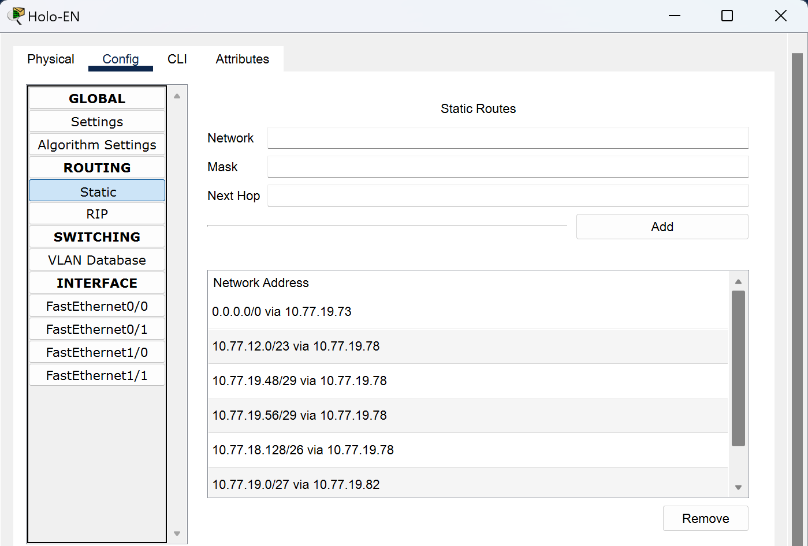

### Holo-Myth

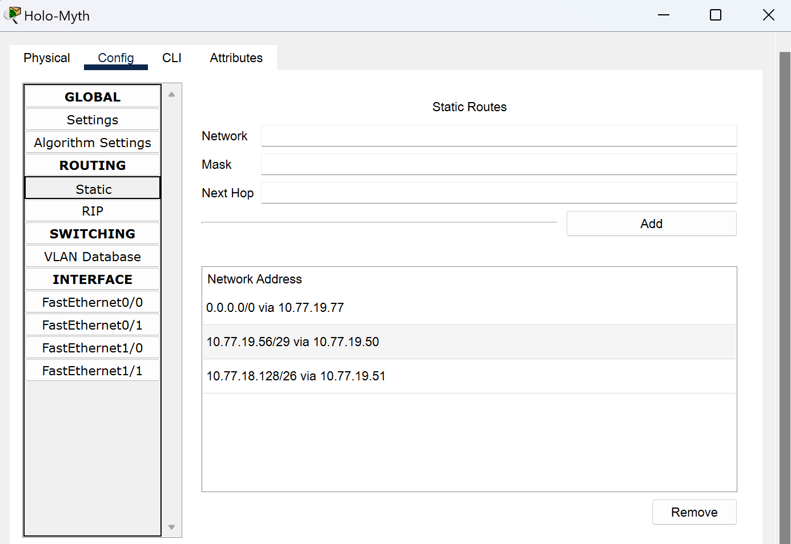

### Holo-Council

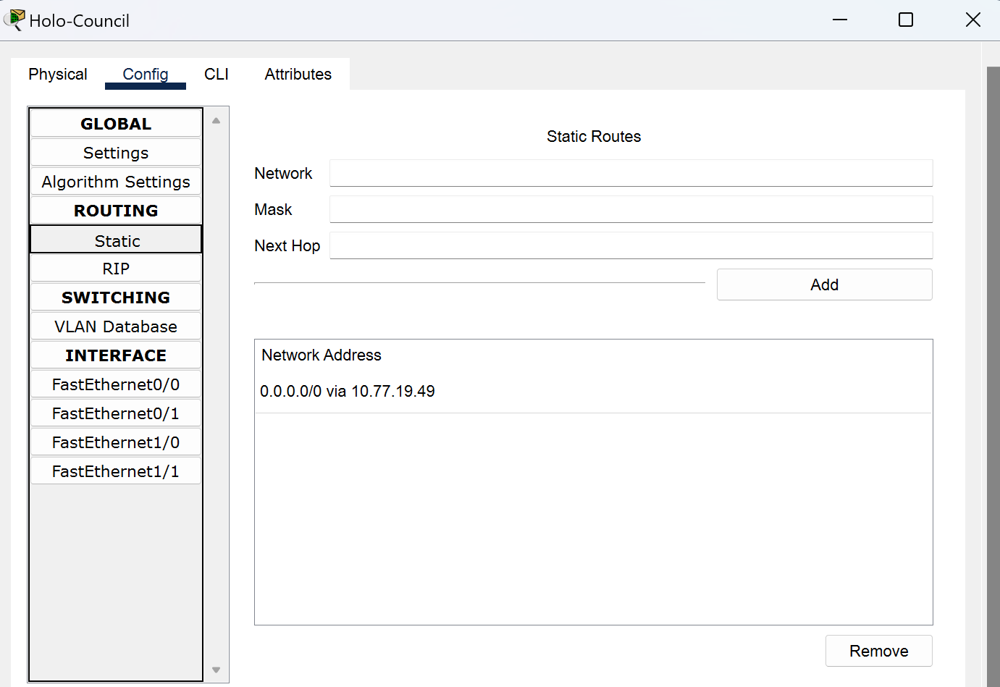

### Router4

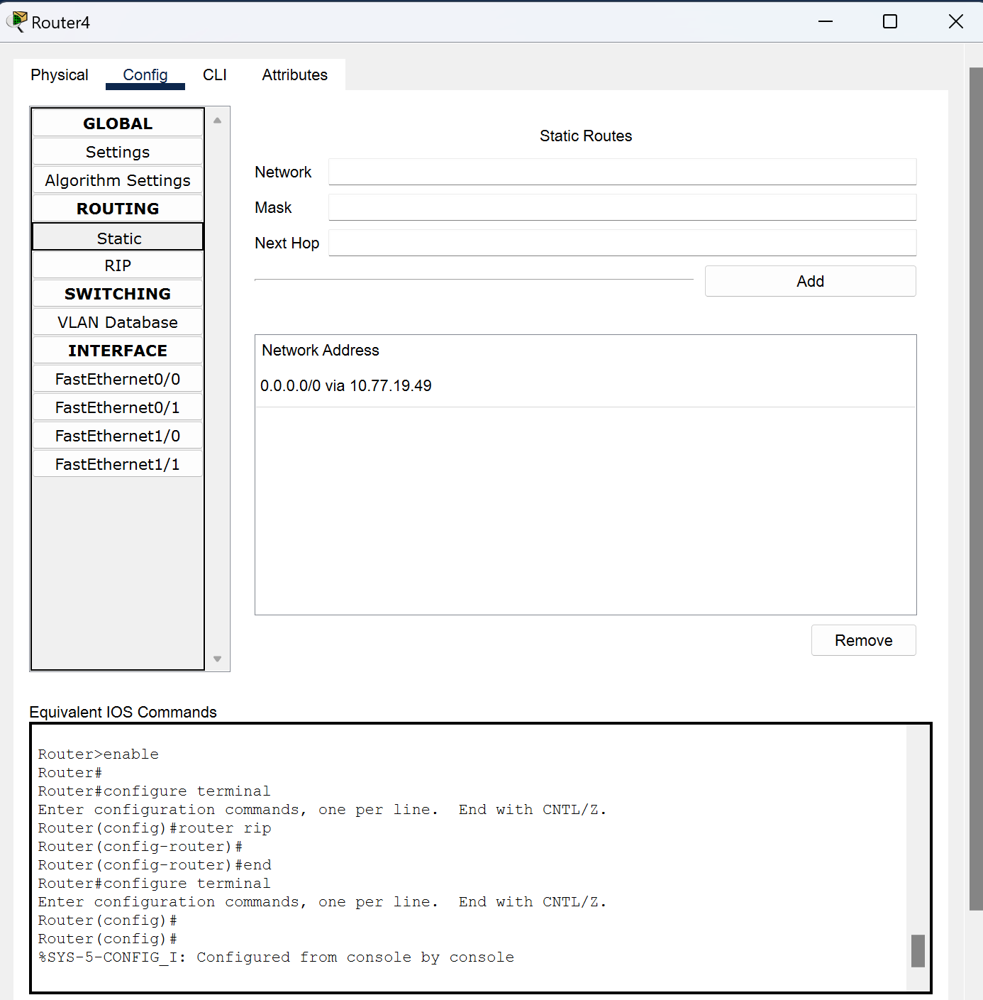

### HoloAdvent

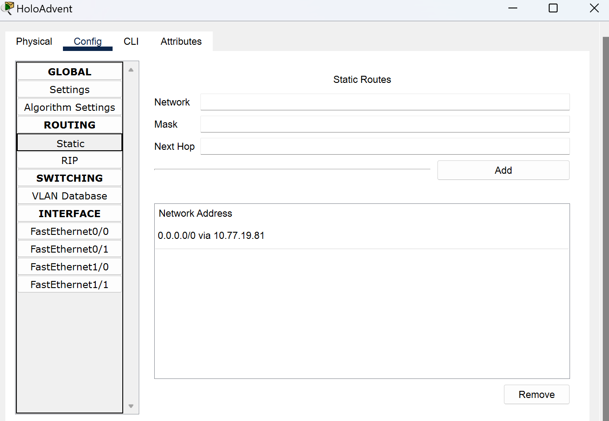

### Holo-JP

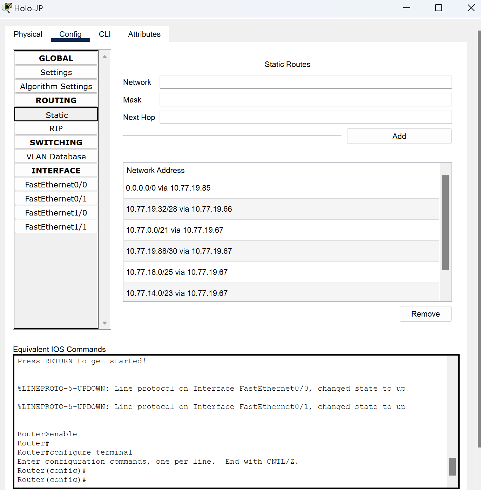

### DEV_IS

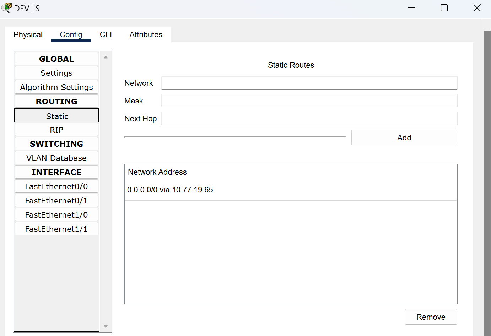

### GEN:0


### GEN:1


### GAMERS

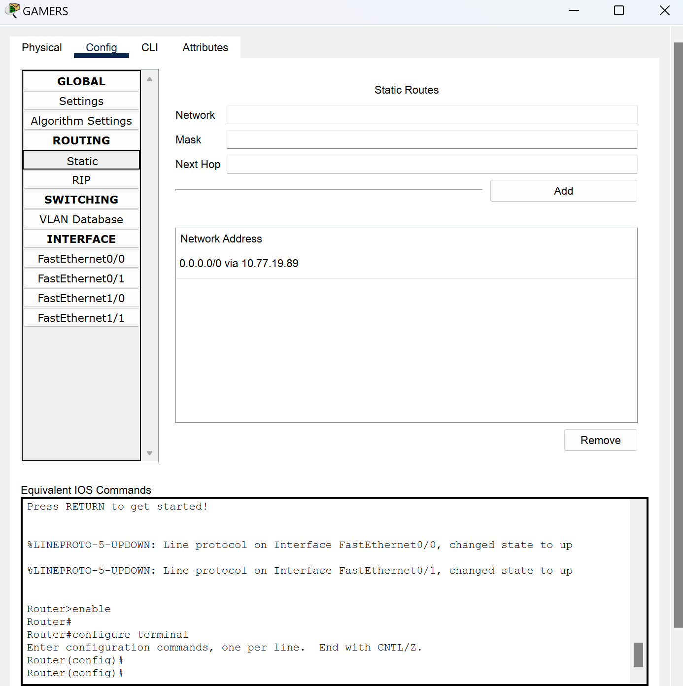

### Holo-ID

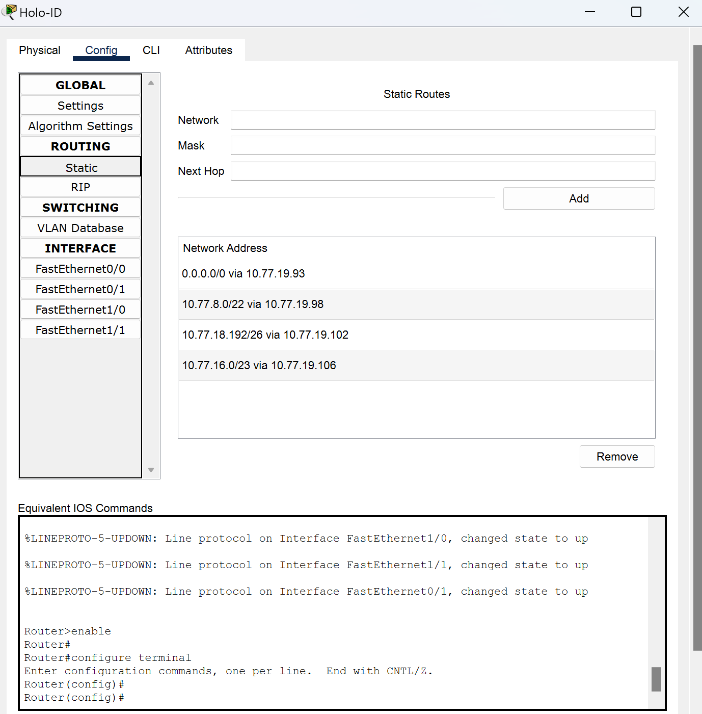

### AREA15

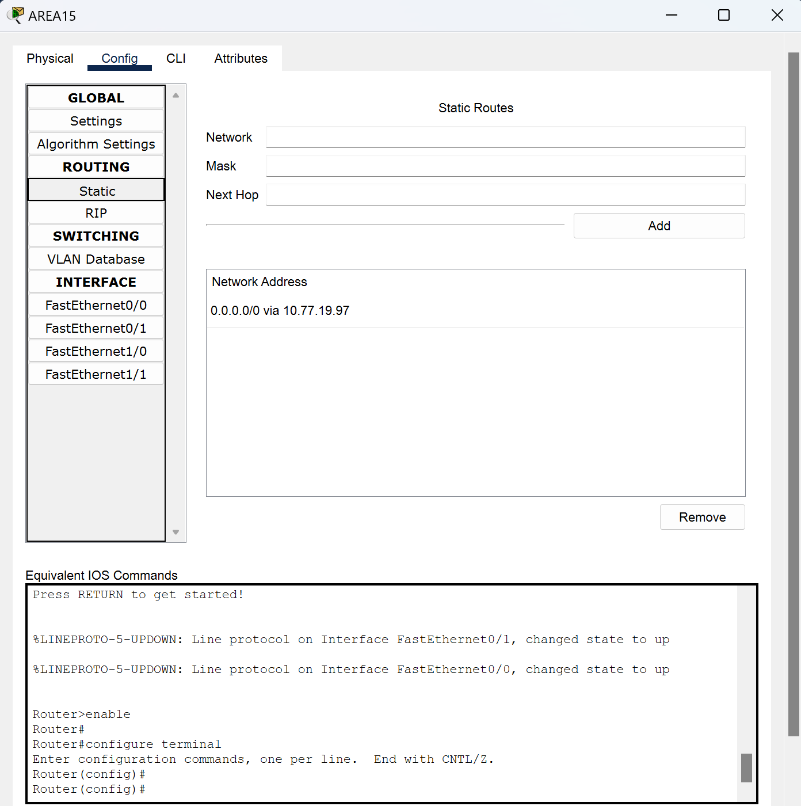

### Holoro

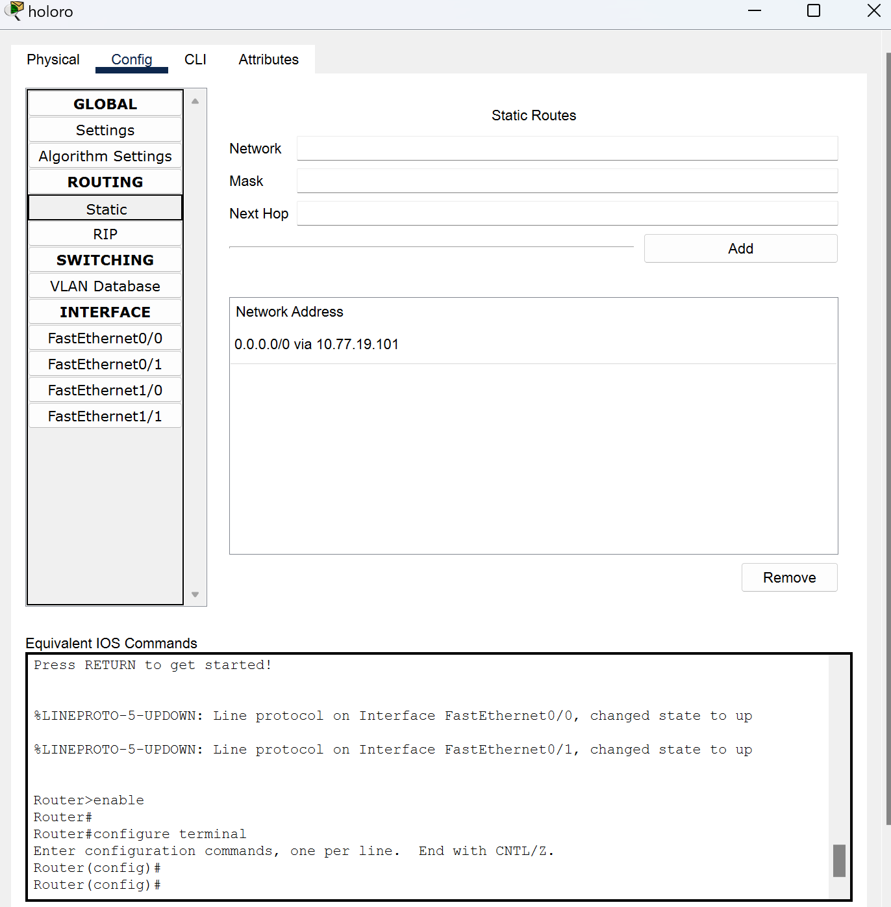

### Holoh3ro

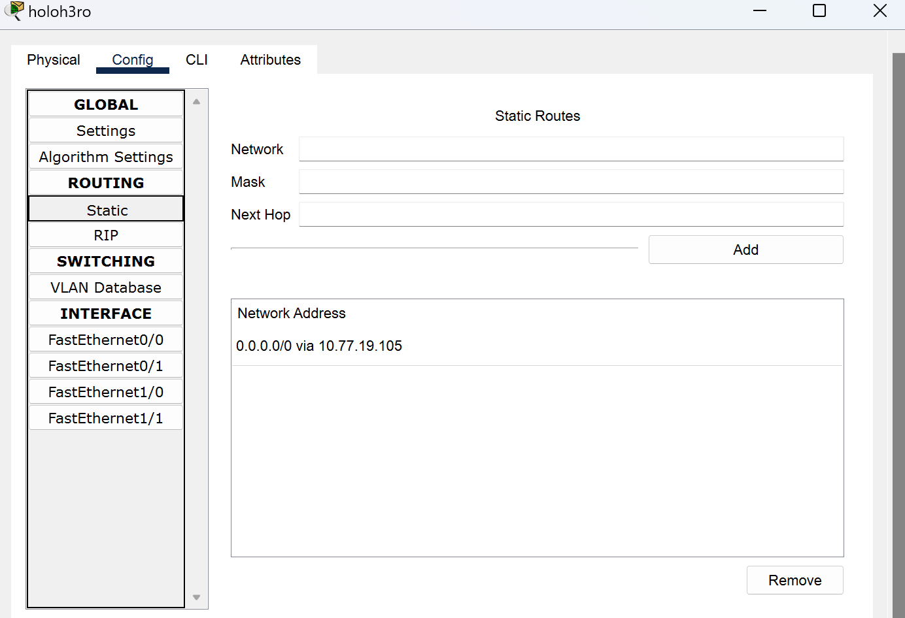

## HASIL PENGUJIAN CPT | VLSM |


## CIDR

Metode CIDR disini menggunakan GNS3 untuk pengaplikasiannya

## Topologi CIDR |GNS3|

Gabungan 1


Gabungan 2


Gabungan 3


Gabungan 4


Gabungan 5


Gabungan 6


Gabungan 7


Gabungan 8


Gabungan 9


Gabungan 10


## Tree CIDR


## Pembagian IP CIDR


## Konfigurasi GNS3 CIDR
**Hololive**

```
# A1
auto eth1
iface eth1 inet static
    address 10.78.16.1
    netmask 255.255.255.252

# A9
auto eth2
iface eth2 inet static
	address 10.77.160.1
	netmask 255.255.255.252

# A16
auto eth3
iface eth3 inet static
	address 10.77.64.1
	netmask 255.255.255.252
```

**Holo-EN**

```
#A1
auto eth0
iface eth0 inet static
	address 10.78.16.2
	netmask 255.255.255.252
	gateway 10.78.16.1

#A2
auto eth1
iface eth1 inet static
	address 10.78.4.1
	netmask 255.255.255.252

#A4
auto eth2
iface eth2 inet static
	address 10.78.8.33
	netmask 255.255.255.252
```

**Holo-Myth**

```
# A2
auto eth0
iface eth0 inet static
	address 10.78.4.2
	netmask 255.255.255.252
	gateway 10.78.4.1

# A6
auto eth1
iface eth1 inet static
	address 10.78.2.129
	netmask 255.255.255.248

# A3
auto eth2
iface eth2 inet static
	address 10.78.0.1
	netmask 255.255.254.0
```

**Gura_Ame_Ina (client)**

```
# A3
auto eth0
iface eth0 inet static
	address 10.78.0.2
	netmask 255.255.254.0
	gateway 10.78.0.1

```

**Kiara_Calli (client)**

```
# A3
auto eth0
iface eth0 inet static
	address 10.78.0.2
	netmask 255.255.254.0
	gateway 10.78.0.1

```

**Holo-Council**

```
# A6
auto eth0
iface eth0 inet static
	address 10.78.2.131
	netmask 255.255.255.248
	gateway 10.78.2.129

# A8
auto eth1
iface eth1 inet static
	address 10.78.2.1
	netmask 255.255.255.192
```

**Kronii_Mumei (client)**

```
# A8
auto eth0
iface eth0 inet static
	address 10.78.2.2
	netmask 255.255.255.192
	gateway 10.78.2.1
```

**Bae_Fauna (client)**

```
# A8
auto eth0
iface eth0 inet static
	address 10.78.2.3
	netmask 255.255.255.192
	gateway 10.78.2.1
```

**Project-Hope**

```
# A6
auto eth0
iface eth0 inet static
	address 10.78.2.130
	netmask 255.255.255.248
	gateway 10.78.2.129

# A7
auto eth1
iface eth1 inet static
	address 10.78.2.65
	netmask 255.255.255.248
```

**Irys (client)**

```
# A7
auto eth0
iface eth0 inet static
	address 10.78.2.66
	netmask 255.255.255.248
	gateway 10.78.2.65
```

**Holo-Advent**

```
#A4
auto eth0
iface eth0 inet static
	address 10.78.8.34
	netmask 255.255.255.252
	gateway 10.78.8.33

#A5
auto eth1
iface eth1 inet static
	address 10.78.8.1
	netmask 255.255.255.224
```

**FuwaMoco (client)**

```
# A5
auto eth0
iface eth0 inet static
	address 10.78.8.2
	netmask 255.255.255.224
	gateway 10.78.8.1
```

**Shiori_Nerissa (client)**

```
# A5
auto eth0
iface eth0 inet static
	address 10.78.8.3
	netmask 255.255.255.224
	gateway 10.78.8.1
```

**Biboo(client)**

```
# A5
auto eth0
iface eth0 inet static
	address 10.78.8.4
	netmask 255.255.255.224
	gateway 10.78.8.1
```

**Holo-ID**

```
# A9
auto eth0
iface eth0 inet static
	address 10.77.160.2
	netmask 255.255.255.252
	
# A10
auto eth1
iface eth1 inet static
	address 10.77.132.1
	netmask 255.255.255.252

# A12
auto eth2
iface eth2 inet static
	address 10.77.144.65
	netmask 255.255.255.252
	
# A14
auto eth3
iface eth3 inet static
	address 10.77.138.1
	netmask 255.255.255.252
```

**AREA15**

```
# A10
auto eth0
iface eth0 inet static
	address 10.77.132.2
	netmask 255.255.255.252
	gateway 10.77.132.1

# A11
auto eth1
iface eth1 inet static
	address 10.77.128.1
	netmask 255.255.252.0
```

**Lofi (client)**

```
# A11
auto eth0
iface eth0 inet static
	address 10.77.128.2
	netmask 255.255.252.0
	gateway 10.77.128.1
```

**Mooana (client)**

```
# A11
auto eth0
iface eth0 inet static
	address 10.77.128.3
	netmask 255.255.252.0
	gateway 10.77.128.1
```

**Risu (client)**

```
# A11
auto eth0
iface eth0 inet static
	address 10.77.128.4
	netmask 255.255.252.0
	gateway 10.77.128.1
```

**Holoro**

```
# A12
auto eth0
iface eth0 inet static
	address 10.77.144.66
	netmask 255.255.255.252
	gateway 10.77.144.65

# A13
auto eth1
iface eth1 inet static
	address 10.77.144.1
	netmask 255.255.255.192
```

**Ollie (client)**

```
# A13
auto eth0
iface eth0 inet static
	address 10.77.144.2
	netmask 255.255.255.192
	gateway 10.77.144.1
```

**Anya (client)**

```
# A13
auto eth0
iface eth0 inet static
	address 10.77.144.3
	netmask 255.255.255.192
	gateway 10.77.144.1
```

**Reine (client)**

```
# A13
auto eth0
iface eth0 inet static
	address 10.77.144.4
	netmask 255.255.255.192
	gateway 10.77.144.1
```

**Holohero**

```
# A14
auto eth0
iface eth0 inet static
	address 10.77.138.2
	netmask 255.255.255.252
	gateway 10.77.138.1

# A15
auto eth1
iface eth1 inet static
	address 10.77.136.1
	netmask 255.255.254.0
```

**Zeta (client)**

```
# A15
auto eth0
iface eth0 inet static
	address 10.77.136.2
	netmask 255.255.254.0
	gateway 10.77.136.1
```

**Kaela (client)**

```
# A15
auto eth0
iface eth0 inet static
	address 10.77.136.3
	netmask 255.255.254.0
	gateway 10.77.136.1
```

**Kobo (client)**

```
# A15
auto eth0
iface eth0 inet static
	address 10.77.136.4
	netmask 255.255.254.0
	gateway 10.77.136.1
```

**Holo-JP**

```
# A16
auto eth0
iface eth0 inet static
	address 10.77.64.2
	netmask 255.255.255.252

# A17
auto eth1
iface eth1 inet static
	address 10.77.32.1
	netmask 255.255.255.248
```

**Dev-IS**

```
# A17
auto eth0
iface eth0 inet static
	address 10.77.32.2
	netmask 255.255.255.248
	gateway 10.77.32.1

# A18
auto eth1
iface eth1 inet static
	address 10.77.16.1
	netmask 255.255.255.240
```

**Ririka_Raden (client)**

```
# A18
auto eth0
iface eth0 inet static
	address 10.77.16.2
	netmask 255.255.255.240
	gateway 10.77.16.1
```

**Ao (client)**

```
# A18
auto eth0
iface eth0 inet static
	address 10.77.16.3
	netmask 255.255.255.240
	gateway 10.77.16.1
```
**Hajime_Kanade (client)**

```
# A18
auto eth0
iface eth0 inet static
	address 10.77.16.4
	netmask 255.255.255.240
	gateway 10.77.16.1
```

**GEN:0**

```
# A17
auto eth0
iface eth0 inet static
	address 10.77.32.3
	netmask 255.255.255.248
	gateway 10.77.32.1

# A19
auto eth1
iface eth1 inet static
	address 10.77.0.1
	netmask 255.255.248.0
```

**MiComet (client)**

```
# A19
auto eth0
iface eth0 inet static
	address 10.77.0.2
	netmask 255.255.248.0
	gateway 10.77.0.1
```

**Sora_Robo_AZKi (client)**

```
# A19
auto eth0
iface eth0 inet static
	address 10.77.0.3
	netmask 255.255.248.0
	gateway 10.77.0.1
```

**GEN:1**

```
# A19
auto eth0
iface eth0 inet static
	address 10.77.0.4
	netmask 255.255.248.0
	gateway 10.77.0.1

# A20
auto eth1
iface eth1 inet static
	address 10.77.10.129 
	netmask 255.255.255.252

# A22
auto eth2
iface eth2 inet static
	address 10.77.8.1
	netmask 255.255.254.0
```

**FBK_Matsuri (client)**

```
# A22
auto eth0
iface eth0 inet static
	address 10.77.8.2
	netmask 255.255.254.0
	gateway 10.77.8.1
```

**Aki_Hachama (client)**

```
# A22
auto eth0
iface eth0 inet static
	address 10.77.8.3
	netmask 255.255.254.0
	gateway 10.77.8.1
```

**Gamers**

```
# A20
auto eth0
iface eth0 inet static
	address 10.77.10.130
	netmask 255.255.255.252
	gateway 10.77.10.129 

# A21
auto eth1
iface eth1 inet static
	address 10.77.10.1
	netmask 255.255.255.128
```

**Korone (client)**

```
# A21
auto eth0
iface eth0 inet static
	address 10.77.10.2
	netmask 255.255.255.128
	gateway 10.77.10.1
```

**Okayu (client)**

```
# A21
auto eth0
iface eth0 inet static
	address 10.77.10.3
	netmask 255.255.255.128
	gateway 10.77.10.1
```

**Mio (client)**

```
# A21
auto eth0
iface eth0 inet static
	address 10.77.10.4
	netmask 255.255.255.128
	gateway 10.77.10.1
```

## Routing GNS3 CIDR
**Hololive**

```
#A2 
post-up route add -net 10.78.4.0 netmask 255.255.255.252 gw 10.78.16.2

#A3
post-up route add -net 10.78.0.0 netmask 255.255.254.0 gw 10.78.16.2

#A4
post-up route add -net 10.78.8.32 netmask 255.255.255.252 gw 10.78.16.2

#A5
post-up route add -net 10.78.8.0 netmask 255.255.255.224 gw 10.78.16.2

#A6
post-up route add -net 10.78.2.128 netmask 255.255.255.248 gw 10.78.16.2

#A7
post-up route add -net 10.78.2.64 netmask 255.255.255.248 gw 10.78.16.2

#A8
post-up route add -net 10.78.2.0 netmask 255.255.255.192 gw 10.78.16.2

#A10
post-up route add -net 10.77.132.0 netmask 255.255.255.252 gw 10.77.160.2

#A11
post-up route add -net 10.77.128.0 netmask 255.255.252.0 gw 10.77.160.2

#A12
post-up route add -net 10.77.144.64 netmask 255.255.255.252 gw 10.77.160.2

#A13
post-up route add -net 10.77.144.0 netmask 255.255.255.192 gw 10.77.160.2

#A14
post-up route add -net 10.77.138.0 netmask 255.255.255.252 gw 10.77.160.2

#A15
post-up route add -net 10.77.136.0 netmask 255.255.254.0 gw 10.77.160.2

#A17
post-up route add -net 10.77.32.0 netmask 255.255.255.248 gw 10.77.64.2

#A18
post-up route add -net 10.77.16.0 netmask 255.255.255.240 gw 10.77.64.2

#A19
post-up route add -net 10.77.0.0 netmask 255.255.248.0 gw 10.77.64.2

#A20
post-up route add -net 10.77.10.128 netmask 255.255.255.252 gw 10.77.64.2

#A21
post-up route add -net 10.77.10.0 netmask 255.255.255.128 gw 10.77.64.2

#A22
post-up route add -net 10.77.8.0 netmask 255.255.254.0 gw 10.77.64.2
```

**Holo-EN**

```
#A3
post-up route add -net 10.78.0.0 netmask 255.255.254.0 gw 10.78.4.2

#A5
post-up route add -net 10.78.8.0 netmask 255.255.255.224 gw 10.78.8.34

#A6
post-up route add -net 10.78.2.128 netmask 255.255.255.248 gw 10.78.4.2

#A7
post-up route add -net 10.78.2.64 netmask 255.255.255.248 gw 10.78.4.2

#A8
post-up route add -net 10.78.2.0 netmask 255.255.255.192 gw 10.78.4.2
```

**Holo-Myth**

```
#A1
post-up route add -net 10.78.16.0 netmask 255.255.255.252 gw 10.78.4.1

#A7
post-up route add -net 10.78.2.64 netmask 255.255.255.248 gw 10.78.2.130

#A8
post-up route add -net 10.78.2.0 netmask 255.255.255.192 gw 10.78.2.131
```

**Holo-Council**

```
#A1
post-up route add -net 10.78.16.0 netmask 255.255.255.252 gw 10.78.4.1

#A2
post-up route add -net 10.78.4.0 netmask 255.255.255.252 gw 10.78.2.129
```

**Project-Hope**

```
#A1
post-up route add -net 10.78.16.0 netmask 255.255.255.252 gw 10.78.4.1

#A2
post-up route add -net 10.78.4.0 netmask 255.255.255.252 gw 10.78.2.129
```

**Holo-Advent**

```
#A1
post-up route add -net 10.78.16.0 netmask 255.255.255.252 gw 10.78.8.33
```

**Holo-ID**

```
#A1
post-up route add -net 10.78.16.0 netmask 255.255.255.252 gw 10.77.160.1

#A2
post-up route add -net 10.78.4.0 netmask 255.255.255.252 gw 10.77.160.1

#A3
post-up route add -net 10.78.0.0 netmask 255.255.254.0 gw 10.77.160.1

#A4
post-up route add -net 10.78.8.32 netmask 255.255.255.252 gw 10.77.160.1

#A5
post-up route add -net 10.78.8.0 netmask 255.255.255.224 gw 10.77.160.1

#A6
post-up route add -net 10.78.2.128 netmask 255.255.255.248 gw 10.77.160.1

#A7
post-up route add -net 10.78.2.64 netmask 255.255.255.248 gw 10.77.160.1

#A8
post-up route add -net 10.78.2.0 netmask 255.255.255.192 gw 10.77.160.1

#A11
post-up route add -net 10.77.128.0 netmask 255.255.252.0 gw 10.77.132.2

#A13
post-up route add -net 10.77.144.0 netmask 255.255.255.192 gw 10.77.144.66

#A15
post-up route add -net 10.77.136.0 netmask 255.255.254.0 gw 10.77.138.2

#A17
post-up route add -net 10.77.32.0 netmask 255.255.255.248 gw 10.77.160.1

#A18
post-up route add -net 10.77.16.0 netmask 255.255.255.240 gw 10.77.160.1

#A19
post-up route add -net 10.77.0.0 netmask 255.255.248.0 gw 10.77.160.1

#A20
post-up route add -net 10.77.10.128 netmask 255.255.255.252 gw 10.77.160.1

#A21
post-up route add -net 10.77.10.0 netmask 255.255.255.128 gw 10.77.160.1

#A22
post-up route add -net 10.77.8.0 netmask 255.255.254.0 gw 10.77.160.1
```

**AREA15**

```
#A1
post-up route add -net 10.78.16.0 netmask 255.255.255.252 gw 10.77.160.1

#A2 
post-up route add -net 10.78.4.0 netmask 255.255.255.252 gw 10.77.160.1

#A3
post-up route add -net 10.78.0.0 netmask 255.255.254.0 gw 10.77.160.1

#A4
post-up route add -net 10.78.8.32 netmask 255.255.255.252 gw 10.77.160.1

#A5
post-up route add -net 10.78.8.0 netmask 255.255.255.224 gw 10.77.160.1

#A6
post-up route add -net 10.78.2.128 netmask 255.255.255.248 gw 10.77.160.1

#A7
post-up route add -net 10.78.2.64 netmask 255.255.255.248 gw 10.77.160.1

#A8
post-up route add -net 10.78.2.0 netmask 255.255.255.192 gw 10.77.160.1

#A9
post-up route add -net 10.77.160.0 netmask 255.255.255.252 gw 10.77.132.1

#A17
post-up route add -net 10.77.32.0 netmask 255.255.255.248 gw 10.77.132.1

#A18
post-up route add -net 10.77.16.0 netmask 255.255.255.240 gw 10.77.132.1

#A19
post-up route add -net 10.77.0.0 netmask 255.255.248.0 gw 10.77.132.1

#A20
post-up route add -net 10.77.10.128 netmask 255.255.255.252 gw 10.77.132.1

#A21
post-up route add -net 10.77.10.0 netmask 255.255.255.128 gw 10.77.132.1

#A22
post-up route add -net 10.77.8.0 netmask 255.255.254.0 gw 10.77.132.1
```

**Holoro**

```
#A1
post-up route add -net 10.78.16.0 netmask 255.255.255.252 gw 10.77.160.1

#A2 
post-up route add -net 10.78.4.0 netmask 255.255.255.252 gw 10.77.160.1

#A3
post-up route add -net 10.78.0.0 netmask 255.255.254.0 gw 10.77.160.1

#A4
post-up route add -net 10.78.8.32 netmask 255.255.255.252 gw 10.77.160.1

#A5
post-up route add -net 10.78.8.0 netmask 255.255.255.224 gw 10.77.160.1

#A6
post-up route add -net 10.78.2.128 netmask 255.255.255.248 gw 10.77.160.1

#A7
post-up route add -net 10.78.2.64 netmask 255.255.255.248 gw 10.77.160.1

#A8
post-up route add -net 10.78.2.0 netmask 255.255.255.192 gw 10.77.160.1

#A9
post-up route add -net 10.77.160.0 netmask 255.255.255.252 gw 10.77.144.65

#A17
post-up route add -net 10.77.32.0 netmask 255.255.255.248 gw 10.77.144.65

#A18
post-up route add -net 10.77.16.0 netmask 255.255.255.240 gw 10.77.144.65

#A19
post-up route add -net 10.77.0.0 netmask 255.255.248.0 gw 10.77.144.65

#A20
post-up route add -net 10.77.10.128 netmask 255.255.255.252 gw 10.77.144.65

#A21
post-up route add -net 10.77.10.0 netmask 255.255.255.128 gw 10.77.144.65

#A22
post-up route add -net 10.77.8.0 netmask 255.255.254.0 gw 10.77.144.65
```

**Holohero**

```
#A1
post-up route add -net 10.78.16.0 netmask 255.255.255.252 gw 10.77.160.1

#A2 
post-up route add -net 10.78.4.0 netmask 255.255.255.252 gw 10.77.160.1

#A3
post-up route add -net 10.78.0.0 netmask 255.255.254.0 gw 10.77.160.1

#A4
post-up route add -net 10.78.8.32 netmask 255.255.255.252 gw 10.77.160.1

#A5
post-up route add -net 10.78.8.0 netmask 255.255.255.224 gw 10.77.160.1

#A6
post-up route add -net 10.78.2.128 netmask 255.255.255.248 gw 10.77.160.1

#A7
post-up route add -net 10.78.2.64 netmask 255.255.255.248 gw 10.77.160.1

#A8
post-up route add -net 10.78.2.0 netmask 255.255.255.192 gw 10.77.160.1

#A9
post-up route add -net 10.77.160.0 netmask 255.255.255.252 gw 10.77.138.1

#A17
post-up route add -net 10.77.32.0 netmask 255.255.255.248 gw 10.77.138.1

#A18
post-up route add -net 10.77.16.0 netmask 255.255.255.240 gw 10.77.138.1

#A19
post-up route add -net 10.77.0.0 netmask 255.255.248.0 gw 10.77.138.1

#A20
post-up route add -net 10.77.10.128 netmask 255.255.255.252 gw 10.77.138.1

#A21
post-up route add -net 10.77.10.0 netmask 255.255.255.128 gw 10.77.138.1

#A22
post-up route add -net 10.77.8.0 netmask 255.255.254.0 gw 10.77.138.1
```

**Hol0-JP**

```
#A18
post-up route add -net 10.77.16.0 netmask 255.255.255.240 gw 10.77.32.2

#A19
post-up route add -net 10.77.0.0 netmask 255.255.248.0 gw 10.77.32.3

#A20
post-up route add -net 10.77.10.128 netmask 255.255.255.252 gw 10.77.32.3

#A21
post-up route add -net 10.77.10.0 netmask 255.255.255.128 gw 10.77.32.3

#A22
post-up route add -net 10.77.8.0 netmask 255.255.254.0 gw 10.77.32.3
```

**Dev-IS**

```
#A16
post-up route add -net 10.77.64.0 netmask 255.255.255.252 gw 10.77.32.1

#A19
post-up route add -net 10.77.0.0 netmask 255.255.248.0 gw 10.77.32.3

#A20
post-up route add -net 10.77.10.128 netmask 255.255.255.252 gw 10.77.32.3

#A21
post-up route add -net 10.77.10.0 netmask 255.255.255.128 gw 10.77.32.3

#A22
post-up route add -net 10.77.8.0 netmask 255.255.254.0 gw 10.77.32.3
```

**GEN:0**

```
#A16
post-up route add -net 10.77.64.0 netmask 255.255.255.252 gw 10.77.32.1

#A18
post-up route add -net 10.77.16.0 netmask 255.255.255.240 gw 10.77.32.2

#A20
post-up route add -net 10.77.10.128 netmask 255.255.255.252 gw 10.77.0.4

#A21
post-up route add -net 10.77.10.0 netmask 255.255.255.128 gw 10.77.0.4

#A22
post-up route add -net 10.77.8.0 netmask 255.255.254.0 gw 10.77.0.4
```

**GEN:1**

```
#A16
post-up route add -net 10.77.64.0 netmask 255.255.255.252 gw 10.77.32.1

#A21
post-up route add -net 10.77.10.0 netmask 255.255.255.128 gw 10.77.10.130
```

**Gamers**

```
#A16
post-up route add -net 10.77.64.0 netmask 255.255.255.252 gw 10.77.32.1

#A19
post-up route add -net 10.77.0.0 netmask 255.255.248.0 gw 10.77.0.1
```

### LINK REVISI CIDR

https://youtu.be/91ybnUuZftA?si=ObLXZDw3mMD3yjmm
