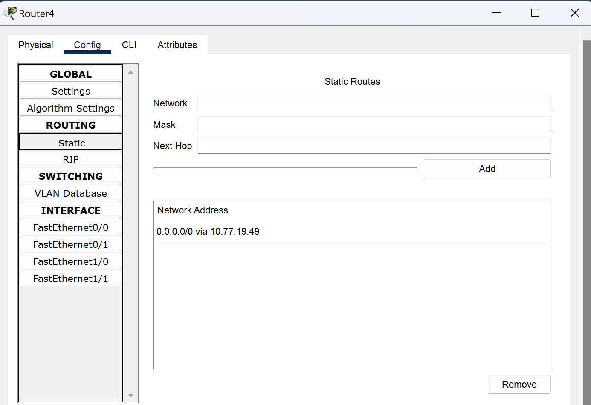
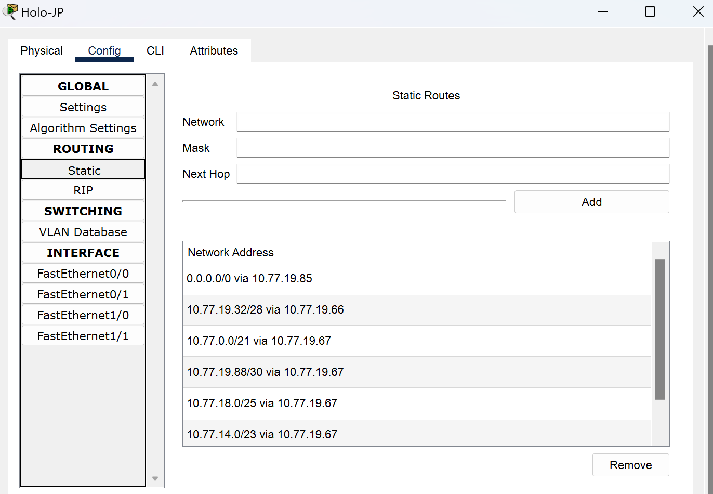
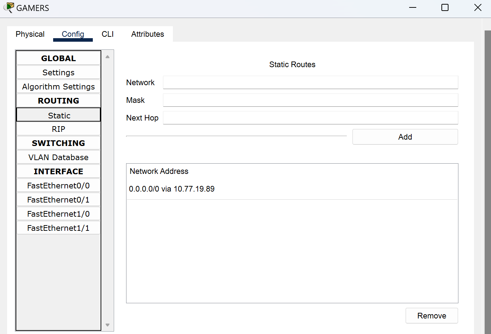
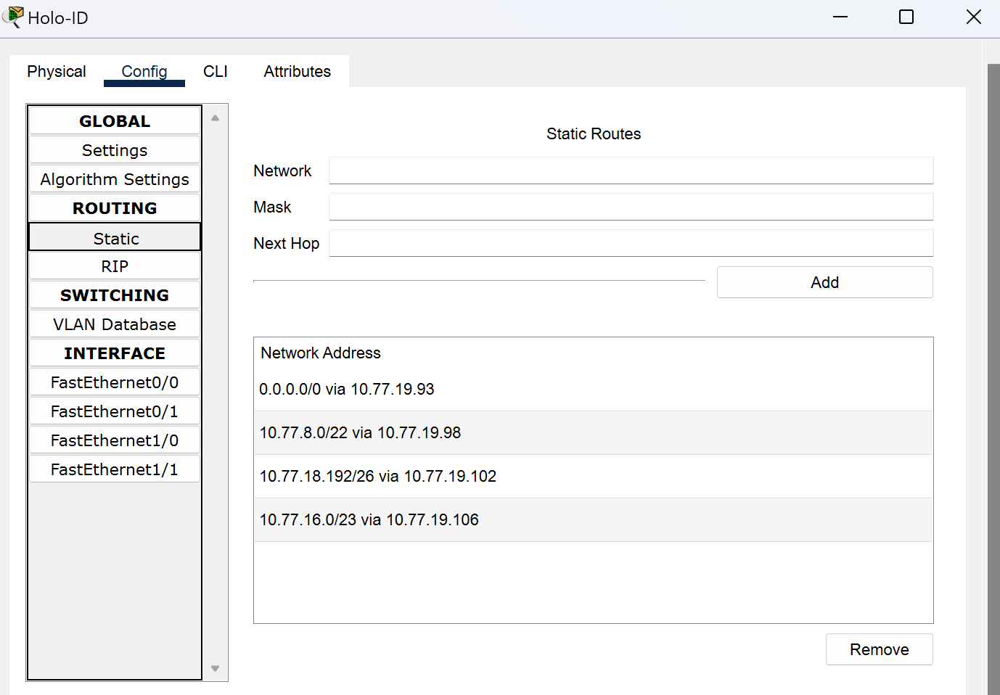
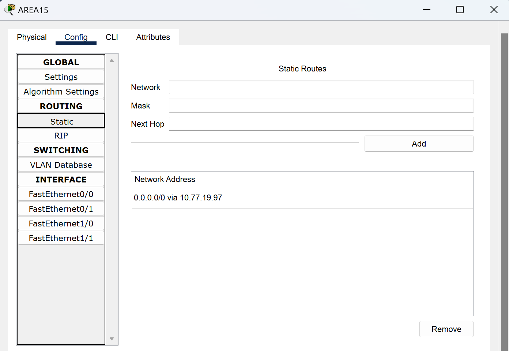
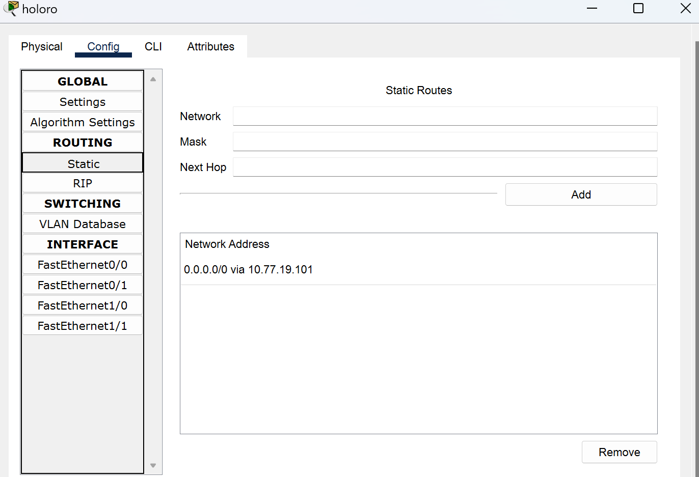

# Jarkom-Modul-4-IT27-2024

## IT 27

| No  | Nama Anggota          | NRP        |
| --- | --------------------- | ---------- |
| 1   | Danendra Fidel Khansa | 5027231063 |
| 2   | Farida Qurrotu A'yuna | 5027231015 |

## IP PREFIX

`10.77`

## DAFTAR ISI

- [Rute Subnet](#rute-subnet)
- [VLSM](#vlsm)
- [CIDR](#cidr)

## Topologi Cisco Packet Tracer | VLSM |

## RUTE SUBNET

| Nama Subnet | Rute                                                                                        | Jumlah IP | Netmask |
| ----------- | ------------------------------------------------------------------------------------------- | --------- | ------- |
| A1          | Hololive > HoloEN                                                                           | 2         | /30     |
| A2          | Hololive > HoloEN > Holo-Myth                                                               | 2         | /30     |
| A3          | Hololive > HoloEN > Holo-Myth > SW2 > Gura_Ame_Ina, Kiara Calli                             | 503       | /23     |
| A4          | Hololive > HoloEN > Holo-Myth > HoloPromise > Router4, Holo-Council                         | 3         | /29     |
| A5          | Hololive > HoloEN > Holo-Myth > HoloPromise > Router4 > Tys                                 | 3         | /29     |
| A6          | Hololive > HoloEN > Holo-Myth > HoloPromise > Holo-Council > SW4 > Kronii_Mumei, Bae_Fauna  | 62        | /26     |
| A7          | Hololive > HoloEN > HoloAdvent                                                              | 2         | /30     |
| A8          | Hololive > HoloEN > HoloAdvent > SW0 > FuwaMoco, Shiori_Nerissa, Biboo                      | 28        | /27     |
| A9          | Hololive > Holo-JP                                                                          | 2         | /30     |
| A10         | Hololive > Holo-JP > SW1 > DEV_IS, GEN:0                                                    | 3         | /29     |
| A11         | Hololive > Holo-JP > SW1 > DEV_IS > Re:GLO$$ > Ririka_Raden, Ao, Hajime_Kanade              | 14        | /28     |
| A12         | Hololive > Holo-JP > SW1 > DEV_IS, GEN:0 > SW3 > MiComet, Sora_Robo_AZki, GEN:1             | 2045      | /21     |
| A13         | Hololive > Holo-JP > SW1 > DEV_IS, GEN:0 > SW3 > GEN:1 > GAMERS                             | 2         | /30     |
| A14         | Hololive > Holo-JP > SW1 > DEV_IS, GEN:0 > SW3 > GEN:1 > GAMERS > SW13 > Korone, Okayu, Mio | 120       | /25     |
| A15         | Hololive > Holo-JP > SW1 > DEV_IS, GEN:0 > SW3 > GEN:1 > Member > PBK_Matsuri, Aki_Hachama  | 470       | /23     |
| A16         | Hololive > Holo-ID                                                                          | 2         | /30     |
| A17         | Hololive > Holo-ID > SW6 > AREA15                                                           | 2         | /30     |
| A18         | Hololive > Holo-ID > SW6 > AREA15 > Moona, Bisu, lofi                                       | 661       | /22     |
| A19         | Hololive > Holo-ID > holoro                                                                 | 2         | /30     |
| A20         | Hololive > Holo-ID > holoro > SW7, Ollie, Anya, Reine                                       | 34        | /26     |
| A21         | Hololive > Holo-ID > holoh3ro                                                               | 2         | /30     |
| A22         | Hololive > Holo-ID > holoh3ro > SW8 > Zeta, Kaela, Kobo                                     | 299       | /23     |
| TOTAL       |                                                                                             | 4263      | /19     |

## VLSM

Metode VLSM Sendiri disini digunakan pada Cisco Packet Tracer `CPT`

## TREE VLSM

Berikut Treenya :

## PEMBAGIAN IP VLSM

Berikut Pembagian IPnya :

| Subnet | Network ID   | Netmask         | Broadcast    | Range IP                    |
| ------ | ------------ | --------------- | ------------ | --------------------------- |
| A12    | 10.77.0.0    | 255.255.248.0   | 10.77.7.255  | 10.77.0.1 - 10.77.7.254     |
| A18    | 10.77.8.0    | 255.255.252.0   | 10.77.11.255 | 10.77.8.1 - 10.77.11.254    |
| A3     | 10.77.12.0   | 255.255.254.0   | 10.77.13.255 | 10.77.12.1 - 10.77.13.254   |
| A15    | 10.77.14.0   | 255.255.254.0   | 10.77.15.255 | 10.77.14.1 - 10.77.15.254   |
| A22    | 10.77.16.0   | 255.255.254.0   | 10.77.17.255 | 10.77.16.1 - 10.77.17.254   |
| A14    | 10.77.18.0   | 255.255.255.128 | 10.77.18.127 | 10.77.18.1 - 10.77.18.126   |
| A6     | 10.77.18.128 | 255.255.255.192 | 10.77.18.191 | 10.77.18.129 - 10.77.18.190 |
| A20    | 10.77.18.192 | 255.255.255.192 | 10.77.18.255 | 10.77.18.193 - 10.77.18.254 |
| A8     | 10.77.19.0   | 255.255.255.224 | 10.77.19.31  | 10.77.19.1 - 10.77.19.30    |
| A11    | 10.77.19.32  | 255.255.255.240 | 10.77.19.47  | 10.77.19.33 - 10.77.19.46   |
| A4     | 10.77.19.48  | 255.255.255.248 | 10.77.19.55  | 10.77.19.49 - 10.77.19.54   |
| A5     | 10.77.19.56  | 255.255.255.248 | 10.77.19.63  | 10.77.19.57 - 10.77.19.62   |
| A10    | 10.77.19.64  | 255.255.255.248 | 10.77.19.71  | 10.77.19.65 - 10.77.19.70   |
| A1     | 10.77.19.72  | 255.255.255.252 | 10.77.19.75  | 10.77.19.73 - 10.77.19.74   |
| A2     | 10.77.19.76  | 255.255.255.252 | 10.77.19.79  | 10.77.19.77 - 10.77.19.78   |
| A7     | 10.77.19.80  | 255.255.255.252 | 10.77.19.83  | 10.77.19.81 - 10.77.19.82   |
| A9     | 10.77.19.84  | 255.255.255.252 | 10.77.19.87  | 10.77.19.85 - 10.77.19.86   |
| A13    | 10.77.19.88  | 255.255.255.252 | 10.77.19.91  | 10.77.19.89 - 10.77.19.90   |
| A16    | 10.77.19.92  | 255.255.255.252 | 10.77.19.95  | 10.77.19.93 - 10.77.19.94   |
| A17    | 10.77.19.96  | 255.255.255.252 | 10.77.19.99  | 10.77.19.97 - 10.77.19.98   |
| A19    | 10.77.19.100 | 255.255.255.252 | 10.77.19.103 | 10.77.19.101 - 10.77.19.102 |
| A21    | 10.77.19.104 | 255.255.255.252 | 10.77.19.107 | 10.77.19.105 - 10.77.19.106 |

## KONFIGURASI ROUTING

### Hololive

### Holo-EN

### Holo-Myth

### Holo-Council

### Router4

### HoloAdvent

### Holo-JP

### DEV_IS

### GEN:0

### GEN:1

### GAMERS

### Holo-ID

### AREA15

### Holoro

### Holoh3ro

## HASIL PENGUJIAN CPT | VLSM |

## CIDR

Metode CIDR disini menggunakan GNS3 untuk pengaplikasiannya

## Topologi CIDR |GNS3|

Gabungan 1

Gabungan 2

Gabungan 3

Gabungan 4

Gabungan 5

Gabungan 6

Gabungan 7

Gabungan 8

Gabungan 9

Gabungan 10

### Penggabungan Netmask

### Tree CIDR

### Pembagian IP CIDR

